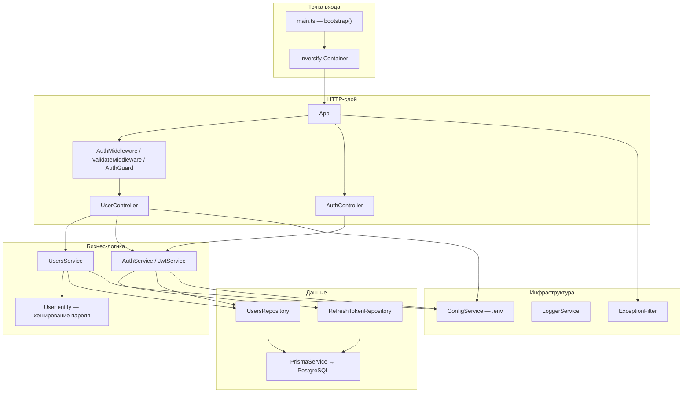
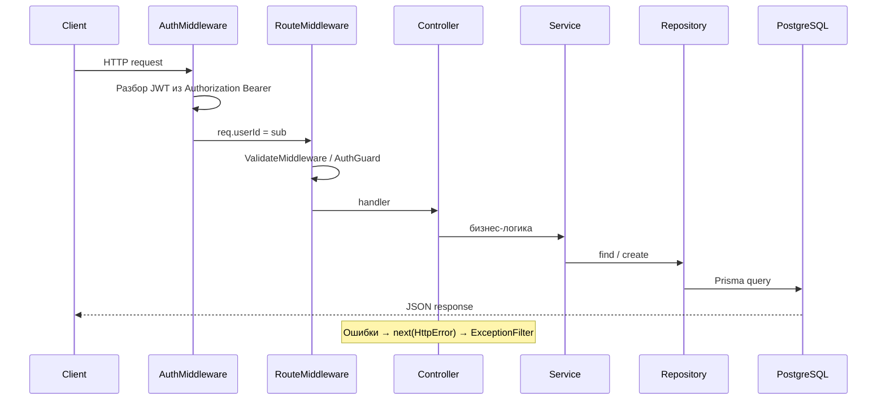
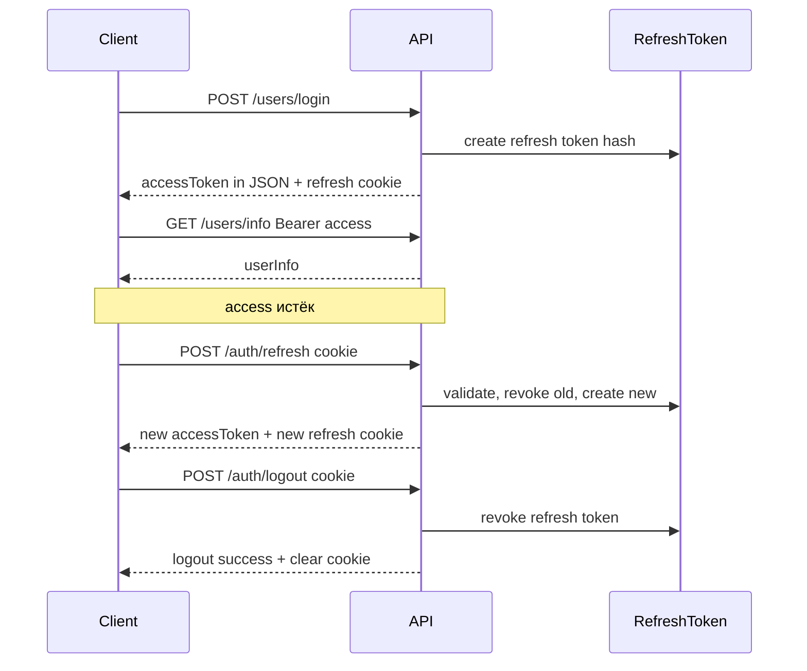

# Архитектура Express-приложения

## Обзор

REST API на **Express 5 + TypeScript**

Архитектура — **слоистая** с **Dependency Injection** (Inversify), **Prisma** (PostgreSQL) и декларативной маршрутизацией через `BaseController`.

## Структура каталогов

```
src/
├── main.ts              # Точка входа, DI-контейнер
├── app.ts               # Сборка Express-приложения
├── types.ts             # Символы для Inversify
├── config/              # Чтение .env
├── database/            # PrismaService (обёртка над PrismaClient)
├── logger/              # Логирование (tslog)
├── errors/              # HttpError + глобальный ExceptionFilter
├── common/              # BaseController, middleware, guards
├── auth/                # JWT, refresh tokens, refresh cookie
└── users/               # Доменный модуль: controller → service → repository
prisma/schema.prisma     # UserModel, RefreshToken
docker-compose.yml       # PostgreSQL для локальной разработки
tests/                   # E2E (supertest)
```

## Слои и зависимости



| Слой | Файлы | Ответственность |
|------|-------|-----------------|
| Bootstrap | `src/main.ts` | Создаёт DI-контейнер, регистрирует все зависимости, вызывает `app.init()` |
| Application | `src/app.ts` | Подключает middleware, маршруты, error handler, запускает сервер |
| Controller | `src/users/users.controller.ts`, `src/auth/auth.controller.ts` | HTTP-эндпоинты, валидация входа, login/register/info, refresh/logout |
| Service | `src/users/users.service.ts`, `src/auth/auth.service.ts` | Пользователи; выпуск, ротация и отзыв token pair |
| Repository | `src/users/users.repository.ts`, `src/auth/refresh-token.repository.ts` | CRUD через Prisma |
| Entity | `src/users/user.entity.ts` | Доменная модель с bcrypt-хешированием |
| Infrastructure | config, logger, prisma, errors | Перекрёстные сервисы |

Каждый слой зависит от **интерфейса** (`IUserService`, `IUsersRepository` и т.д.), а не от конкретной реализации — это упрощает тестирование и замену компонентов.

## Жизненный цикл запуска

1. `src/main.ts` — `bootstrap()` создаёт `Container`, загружает `appBindings`, резолвит `App`.
2. `src/app.ts` — `init()`:
   - `useMiddleware()` — `helmet`, CORS (если задан `CORS_ORIGIN`), `cookie-parser`, `express.json()`, глобальный `AuthMiddleware`
   - `useRoutes()` — монтирует `/users` → `UserController.router`, `/auth` → `AuthController.router`
   - `useExceptionFilters()` — `ExceptionFilter.catch` как error handler
   - `prismaService.connect()` + `listen(PORT)` (по умолчанию `8000`)

## Поток HTTP-запроса



### Глобальный middleware

`AuthMiddleware` (`src/common/auth.middleware.ts`) — **не блокирует** неавторизованные запросы. Если есть валидный access JWT в `Authorization: Bearer`, записывает `req.userId` из claim `sub`.

Защита конкретных эндпоинтов — через `AuthGuard`.

### Маршруты auth и users

Определяются декларативно в конструкторах контроллеров через `bindRoutes()` из `BaseController`:

| Метод | Путь | Middleware | Действие |
|-------|------|------------|----------|
| POST | `/users/register` | `RateLimit`, `ValidateMiddleware(UserRegisterDto)` | Создание пользователя |
| POST | `/users/login` | `RateLimit`, `ValidateMiddleware(UserLoginDto)` | Проверка пароля; access в JSON + refresh cookie |
| GET | `/users/info` | `AuthGuard` | Профиль по `req.userId` |
| POST | `/auth/refresh` | `RateLimit`, `ResolveRefreshTokenMiddleware`, `ValidateMiddleware(RefreshDto)` | Ротация refresh token, новый access |
| POST | `/auth/logout` | `RateLimit`, `ResolveRefreshTokenMiddleware`, `ValidateMiddleware(RefreshDto)` | Revoke refresh token, clear cookie |

Валидация DTO — `class-validator` + `class-transformer` в `ValidateMiddleware`. Ошибки валидации возвращают статус `422`.

### Обработка ошибок

Все ошибки API возвращаются в едином формате:

```json
{
  "error": {
    "code": "VALIDATION_ERROR",
    "message": "Validation failed",
    "details": [{ "property": "password", "constraints": { "...": "..." } }]
  }
}
```

Коды: `VALIDATION_ERROR`, `UNAUTHORIZED`, `AUTH_ERROR`, `REGISTRATION_FAILED`, `INTERNAL_SERVER_ERROR`.

- Контроллер и middleware передают ошибки через `next(new HttpError(status, message, { code }))`.
- `ValidateMiddleware` — `422` с `VALIDATION_ERROR` и `details` по полям DTO.
- `AuthGuard` — `401` с `UNAUTHORIZED` через `ExceptionFilter`.
- `ExceptionFilter` — последний middleware: `HttpError` → соответствующий статус; неожиданные ошибки → `500` с generic message (без утечки `error.message`).

## Dependency Injection

Все привязки определены в `src/main.ts` (`ContainerModule`). Символы — `src/types.ts`.

| Компонент | Scope |
|-----------|-------|
| Logger, Config, Prisma, Repository, Service, Controller, ExceptionFilter | Singleton |
| App | Transient (новый экземпляр при каждом resolve) |

## Аутентификация

### Token pair (access + refresh)

- **Access token** — короткий JWT (`HS256`, payload: `{ sub, email, iat, exp }`, секрет `JWT_SECRET`, TTL: `JWT_ACCESS_EXPIRES_IN`).
- **Refresh token** — opaque token (UUID + secret), хеш хранится в таблице `RefreshToken`; TTL: `JWT_REFRESH_EXPIRES_IN`.
- **Ротация**: при `/auth/refresh` старый refresh token отзывается, выдаётся новый access в JSON и новый refresh cookie; повторное использование отозванного токена → `401` и revoke всех сессий пользователя.
- **Logout**: `/auth/logout` отзывает refresh token в БД и очищает cookie.

Модуль `src/auth/`:

| Файл | Назначение |
|------|------------|
| `auth.service.ts` | Выпуск, ротация, revoke token pair |
| `jwt.service.ts` | Подпись access JWT |
| `refresh-token.repository.ts` | CRUD refresh tokens в PostgreSQL |
| `auth-token-delivery.ts` | Access в JSON; refresh — HttpOnly cookie `Path=/auth` |
| `resolve-refresh-token.middleware.ts` | Подстановка refresh в body: body → `X-Refresh-Token` → cookie |

Доставка токенов (без переключателей):

- Login/refresh JSON: `{ accessToken, expiresIn }`
- Refresh: HttpOnly cookie `refreshToken` (`path: /auth`, `sameSite: strict`, `secure` через `AUTH_COOKIE_SECURE` / production)
- Access клиент шлёт как `Authorization: Bearer`
- Для API-клиентов refresh можно передать в body или `X-Refresh-Token`

### Поток login → refresh → info → logout



### Общее

- **Регистрация**: пароль хешируется в `User.setPassword()` с cost factor из `BCRYPT_ROUNDS` (`.env`).
- **Логин**: `UsersService.validateUser()` сравнивает пароль через bcrypt; `AuthService.issueTokenPair()` выпускает access + refresh.
- **Защищённые маршруты**: `AuthMiddleware` (глобально) разбирает access token, `AuthGuard` (на маршруте) проверяет наличие `req.userId`.

## База данных

- Prisma schema: `prisma/schema.prisma` — модели `UserModel` (id, email, password, name) и `RefreshToken` (tokenHash, expiresAt, revokedAt, replacedBy).
- PostgreSQL: `DATABASE_URL` в `.env` (см. `.env.example`).
- Клиент генерируется в `generated/prisma`.
- `PrismaService` — обёртка с `connect()` / `disconnect()`.

## Конфигурация

`ConfigService` читает `.env` через `dotenv`. Используемые ключи:

| Ключ | Назначение |
|------|------------|
| `DATABASE_URL` | Строка подключения к PostgreSQL |
| `PORT` | Порт HTTP-сервера (default: `8000`; `0` — случайный свободный, для e2e) |
| `JWT_SECRET` | Секрет для подписи и проверки JWT |
| `JWT_ACCESS_EXPIRES_IN` | TTL access token (напр. `1h`, `15m`) |
| `JWT_REFRESH_EXPIRES_IN` | TTL refresh token (напр. `7d`, `30d`) |
| `JWT_EXPIRES_IN` | Legacy fallback: TTL access (`jwt.service`) и maxAge refresh cookie, если основные ключи не заданы |
| `BCRYPT_ROUNDS` | Cost factor bcrypt при хешировании пароля |
| `AUTH_COOKIE_SECURE` | `true`/`false` — флаг `Secure` для refresh cookie (default: `true` в production) |
| `CORS_ORIGIN` | Разрешённые origins через запятую (для браузерного клиента с cookies; `credentials: true`) |
| `RATE_LIMIT_WINDOW_MS` | Окно rate limit для auth-эндпоинтов |
| `RATE_LIMIT_MAX` | Макс. запросов в окне rate limit |

## Тестирование

- **Unit** (рядом с кодом): `src/users/users.service.spec.ts`, `src/auth/auth.service.spec.ts`, `src/config/config.validator.spec.ts`, `src/errors/api-error.response.spec.ts`.
- **E2E**: `tests/users.e2e-spec.ts` — register → login → info → refresh/logout через Bearer + refresh cookie.

## Ключевые паттерны

- **BaseController** — абстрактный класс с `bindRoutes()` для декларативной регистрации маршрутов и общими методами ответа (`ok`, `send`, `created`).
- **IMiddleware** — единый интерфейс для `AuthMiddleware`, `ValidateMiddleware`, `AuthGuard`, `ResolveRefreshTokenMiddleware` с методом `execute()`.
- **Entity vs Model** — `User` (entity) инкапсулирует логику пароля; `UserModel` (Prisma) — схема хранения в БД.
