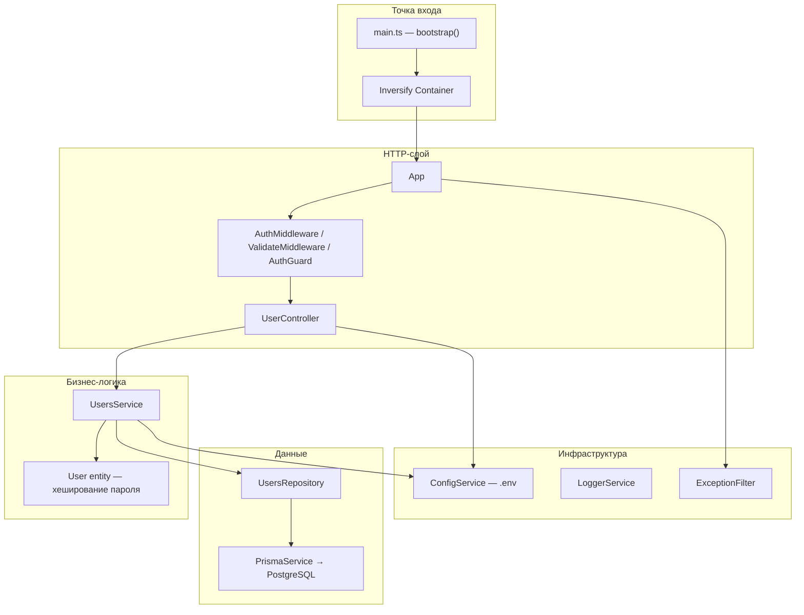

# Архитектура Express-приложения

## Обзор

REST API на **Express 5 + TypeScript**

Архитектура — **слоистая** с **Dependency Injection** (Inversify), **Prisma** (PostgreSQL) и декларативной маршрутизацией через `BaseController`.

## Структура каталогов

```
src/
├── main.ts              # Точка входа, DI-контейнер
├── app.ts               # Сборка Express-приложения
├── types.ts             # Символы для Inversify
├── config/              # Чтение .env
├── database/            # PrismaService (обёртка над PrismaClient)
├── logger/              # Логирование (tslog)
├── errors/              # HttpError + глобальный ExceptionFilter
├── common/              # BaseController, middleware, guards
└── users/               # Доменный модуль: controller → service → repository
prisma/schema.prisma     # Модель UserModel, PostgreSQL
docker-compose.yml       # PostgreSQL для локальной разработки
tests/                   # E2E (supertest) и unit-тесты
```

## Слои и зависимости



| Слой | Файлы | Ответственность |
|------|-------|-----------------|
| Bootstrap | `src/main.ts` | Создаёт DI-контейнер, регистрирует все зависимости, вызывает `app.init()` |
| Application | `src/app.ts` | Подключает middleware, маршруты, error handler, запускает сервер |
| Controller | `src/users/users.controller.ts` | HTTP-эндпоинты, валидация входа, выдача JWT |
| Service | `src/users/users.service.ts` | Бизнес-правила: создание пользователя, проверка пароля |
| Repository | `src/users/users.repository.ts` | CRUD через Prisma |
| Entity | `src/users/user.entity.ts` | Доменная модель с bcrypt-хешированием |
| Infrastructure | config, logger, prisma, errors | Перекрёстные сервисы |

Каждый слой зависит от **интерфейса** (`IUserService`, `IUsersRepository` и т.д.), а не от конкретной реализации — это упрощает тестирование и замену компонентов.

## Жизненный цикл запуска

1. `src/main.ts` — `bootstrap()` создаёт `Container`, загружает `appBindings`, резолвит `App`.
2. `src/app.ts` — `init()`:
   - `useMiddleware()` — `express.json()` + глобальный `AuthMiddleware`
   - `useRoutes()` — монтирует `/users` → `UserController.router`
   - `useExceptionFilters()` — `ExceptionFilter.catch` как error handler
   - `prismaService.connect()` + `listen(8000)`

## Поток HTTP-запроса


### Глобальный middleware

`AuthMiddleware` (`src/common/auth.middleware.ts`) — **не блокирует** неавторизованные запросы. Если в заголовке `Authorization: Bearer <token>` есть валидный JWT, записывает `req.user = email`. Защита конкретных эндпоинтов — через `AuthGuard`.

### Маршруты модуля users

Определяются декларативно в конструкторе `UserController` через `bindRoutes()` из `BaseController`:

| Метод | Путь | Middleware | Действие |
|-------|------|------------|----------|
| POST | `/users/register` | `ValidateMiddleware(UserRegisterDto)` | Создание пользователя |
| POST | `/users/login` | `ValidateMiddleware(UserLoginDto)` | Проверка пароля, выдача JWT |
| GET | `/users/info` | `AuthGuard` | Профиль по `req.user` |

Валидация DTO — `class-validator` + `class-transformer` в `ValidateMiddleware`. Ошибки валидации возвращают статус `422`.

### Обработка ошибок

Все ошибки API возвращаются в едином формате:

```json
{
  "error": {
    "code": "VALIDATION_ERROR",
    "message": "Validation failed",
    "details": [{ "property": "password", "constraints": { "...": "..." } }]
  }
}
```

Коды: `VALIDATION_ERROR`, `UNAUTHORIZED`, `AUTH_ERROR`, `REGISTRATION_FAILED`, `INTERNAL_SERVER_ERROR`.

- Контроллер и middleware передают ошибки через `next(new HttpError(status, message, { code }))`.
- `ValidateMiddleware` — `422` с `VALIDATION_ERROR` и `details` по полям DTO.
- `AuthGuard` — `401` с `UNAUTHORIZED` через `ExceptionFilter`.
- `ExceptionFilter` — последний middleware: `HttpError` → соответствующий статус; неожиданные ошибки → `500` с generic message (без утечки `error.message`).

## Dependency Injection

Все привязки определены в `src/main.ts` (`ContainerModule`). Символы — `src/types.ts`.

| Компонент | Scope |
|-----------|-------|
| Logger, Config, Prisma, Repository, Service, Controller, ExceptionFilter | Singleton |
| App | Transient (новый экземпляр при каждом resolve) |

## Аутентификация

- **Регистрация**: пароль хешируется в `User.setPassword()` с cost factor из `BCRYPT_ROUNDS` (`.env`).
- **Логин**: `UsersService.validateUser()` сравнивает пароль через bcrypt; контроллер подписывает JWT (`HS256`, payload: `{ email, iat }`, секрет `JWT_SECRET`).
- **Защищённые маршруты**: `AuthMiddleware` (глобально) разбирает токен, `AuthGuard` (на маршруте) проверяет наличие `req.user`.

## База данных

- Prisma schema: `prisma/schema.prisma` — модель `UserModel` (id, email, password, name).
- PostgreSQL: `DATABASE_URL` в `.env` (см. `.env.example`).
- Клиент генерируется в `generated/prisma`.
- `PrismaService` — обёртка с `connect()` / `disconnect()`.

## Конфигурация

`ConfigService` читает `.env` через `dotenv`. Используемые ключи:

| Ключ | Назначение |
|------|------------|
| `DATABASE_URL` | Строка подключения к PostgreSQL |
| `JWT_SECRET` | Секрет для подписи и проверки JWT |
| `BCRYPT_ROUNDS` | Cost factor bcrypt при хешировании пароля |

## Тестирование

- **Unit**: `src/users/users.service.spec.ts` — моки репозитория и конфига.
- **E2E**: `tests/users.e2e-spec.ts` — полный цикл через `boot` из `main.ts` + supertest.

## Ключевые паттерны

- **BaseController** — абстрактный класс с `bindRoutes()` для декларативной регистрации маршрутов и общими методами ответа (`ok`, `send`, `created`).
- **IMiddleware** — единый интерфейс для `AuthMiddleware`, `ValidateMiddleware`, `AuthGuard` с методом `execute()`.
- **Entity vs Model** — `User` (entity) инкапсулирует логику пароля; `UserModel` (Prisma) — схема хранения в БД.
